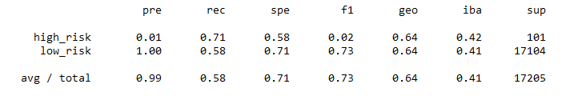
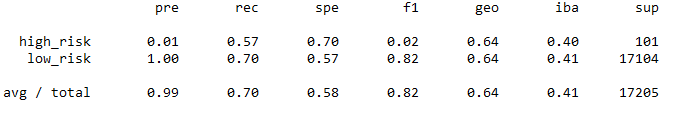
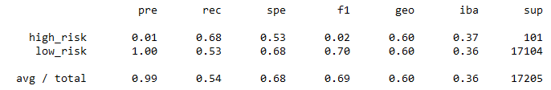
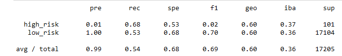
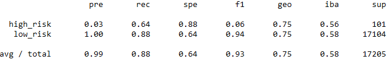
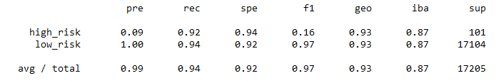

# Credit Risk Analysis

## Overview:
 
 We have been assigned a dataset of credit profiles to determine if any models of machine learning are accurate to solve the problem of credit card risk. We will train and fit to each model then looking at the classification reports made by each to grade each model's performance.
 
## Results: 
### Naive Random Oversampling

### Oversampling

### Undersampling

### Combination

### Balanced Random Forest

### Easy Ensemble

## Summary: 
Looking at the all the models, many of them are unreliable as the F1 scores are low. The model that did the best was the Easy Ensemble Model as it had the highest F1 score and its specificity was also the highest. Of all the models, this one was the one that was the closest to the actual numbers.

